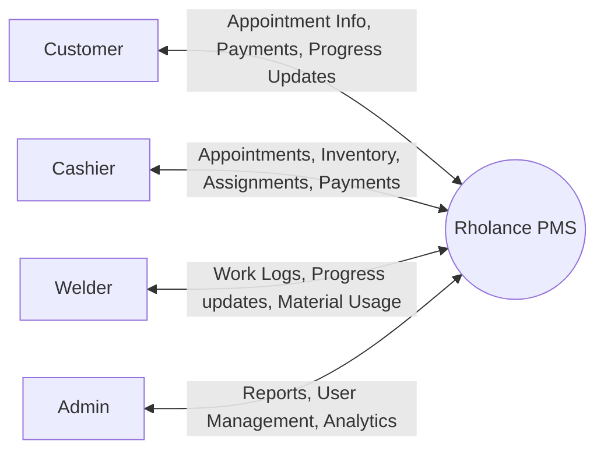
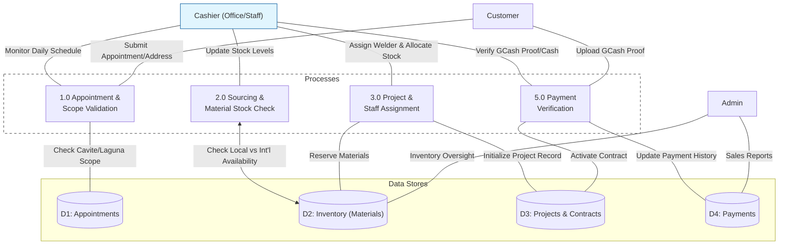
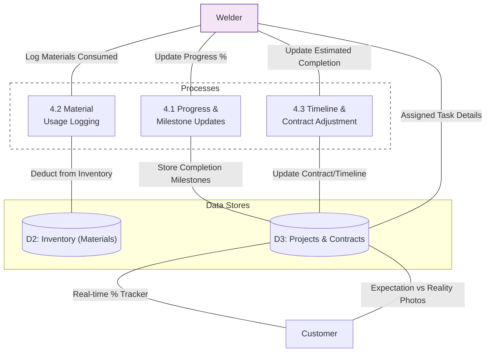

# Data Flow Diagrams: Staff Workflows

This document provides specialized Data Flow Diagrams (DFD) for the **Cashier** and **Welder** roles within the Rholance PMS.

---

## 🟢 Level 0: Context Diagram
The Context Diagram provides a macro view of how all actors interact with the system.

---

## 🔵 Level 1: Cashier Workflow DFD
Focuses on administration, resource allocation, and financial verification.

---

## 🟠 Level 1: Welder Workflow DFD
Focuses on production, real-time tracking, and material consumption.

---

## 📖 Key Role Differences

| Feature | Cashier (Office) | Welder (Production) |
| :--- | :--- | :--- |
| **Primary Focus** | Scheduling & Resource Prep | Fabrication & Tracking |
| **Inventory Action** | Sourcing & Allocation (Reserving) | Consumption & Logging (Deducting) |
| **Project Interaction** | Activation & Assignment | Progress Updates & Timeline Adjustments |
| **Customer Touchpoint** | Scope Validation & Payments | Visual Progress (Photos) & % Updates |
